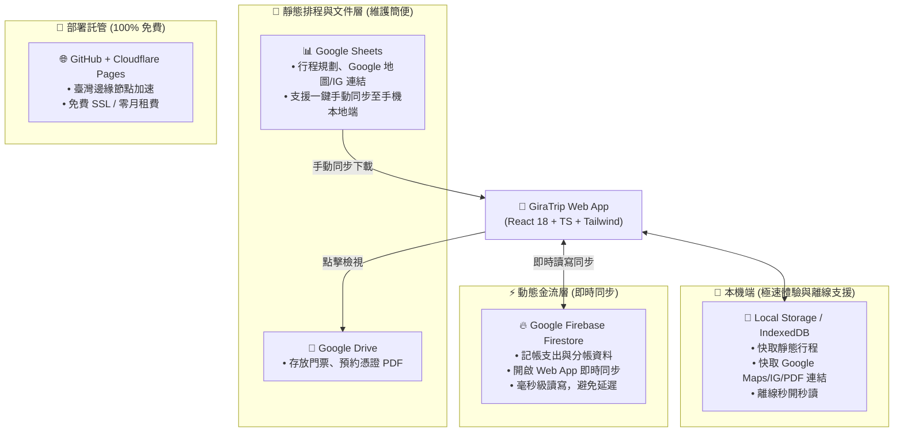

# Gate 1 一頁紙決策儀表板 (GATE 1 DECISION DASHBOARD) - 修訂版

> **專案名稱**：GiraTrip (記啦旅)  
> **版本**：v1.1.0-MVP (已依用戶反饋修訂架構與視覺)  
> **狀態**：等待用戶核准開工 (Pending Approval)  
> **研發管線進度**：【階段 2：三人組辯論收斂】修訂完成 ➔ 【🚦 Gate 1：規格與範疇簽核】  

---

## 一、 品牌與色彩視覺鎖定 (Brand & Design Tokens)

* **品牌名稱**：**GiraTrip (記啦旅)**
  * **Slogan**：「長頸鹿全覽行程，花費輕鬆記啦！」
* **用戶指定專屬暖調配色系統**：
  * **畫布基底 (Canvas Background)**：`#E6E2B5`（溫暖柔和的燕麥淺沙色，告別冷灰，營造旅行手帳溫潤感）
  * **主要文字 (Primary Text)**：`#6E5454`（深焙胡桃暖棕色，對比度高且低視覺疲勞）
  * **次要文字 (Muted Text)**：`#967E7E`（淡焙胡桃灰棕色，用於輔助說明與時間戳記）
  * **卡片表面 (Card Surface)**：`#F2EED9`（輕盈米白奶油色，創造舒適卡片層次）
  * **細緻微邊框 (Border Subtlety)**：`#D5CEBA`（低飽和米灰邊線，維持 1px 精緻感）
  * **主強調色 (Primary Accent)**：`#526655`（冷杉鼠尾草綠，用於重要操作與狀態標籤）
  * **次強調色 (Secondary Accent)**：`#8A6B58`（陶木棕，用於次要互動與警示提示）
* **視覺與圖標規範**：
  * **🚫 零 Emoji 原則**：全站介面嚴格禁用彩色 Emoji，維持洗鍊典雅旅行質感。
  * **純向量細線圖標**：全數使用 `lucide-react` 1.5px~2px 細線條圖標（如 `MapPin`, `Instagram`, `FileText`, `Utensils`, `Receipt`, `Calendar`, `RefreshCw`, `Plus`, `Users`, `CheckCircle`）。

---

## 二、 用戶修訂需求與產品落地矩陣 (User Feedback Slicing)

| 用戶修訂指示 | 產品落地解決方案 |
| :--- | :--- |
| **暫不考慮 LINE，專純 Web App** | 徹底移除 LINE Bot / LIFF 複雜架構，轉為專注打造 **Mobile-First PWA 響應式 Web App**，直接手機瀏覽器開啟、加入主畫面，極速操作。 |
| **行程節點加入 Google 地點、IG 影片、PDF 連結** | 行程卡片擴充三合一媒體欄位： 1. **Google Maps 連結**：一鍵開啟地圖直接導航。 2. **Instagram Reels 連結**：一鍵直達網紅打卡開箱推薦影片。 3. **Google Drive PDF 連結**：一鍵檢視電子門票、機票憑證或訂房單。 |
| **增加「菜單翻譯」功能** | 掃描辨識模組升級為 **「雙模 OCR 引擎（收據辨識 ＋ 菜單翻譯）」**： • 收據模式：萃取金額、幣別、品名並匯入分帳。 • 菜單模式：拍照日/韓/歐美外文菜單，即時逐行翻譯為繁體中文菜名，並支援一鍵轉記帳。 |
| **動態資料走 Firebase，靜態資料走 Google Sheets** | 採 **雙軌混合架構 (Hybrid Cloud)**： • **動態帳目/金流 (Firebase Firestore)**：開啟 Web App 時即時連線更新，記帳後旅伴手機秒級同步更新。 • **靜態行程/連結 (Google Sheets)**：從試算表匯入行程與連結，快取存於手機本機端；需要時點擊「一鍵同步 (Sync)」即可更新。 |
| **支援多旅程建立與切換 (Multi-Trip)** | 建立「**多旅程管理中樞 (Trip Hub)**」： • 支援自由建立新旅行（命名、目的地、日期區間、基礎幣別、成員名單）。 • 旅程列表快速切換，資料完全獨立隔離，歷史旅程可封存回顧。 |

---

## 三、 架構師推薦基礎設施 (Infra Stack - 雙軌 0 元架構)

* **成本評估**：Firebase 免費額度（每天 50,000 次讀取、20,000 次寫入）、Google Sheets API 免費、Google Drive 15GB 免費、Cloudflare Pages 免費。**整套架構每月維護成本維持 NT$ 0 元**。

---

## 四、 MVP 範疇切分清單 (Scope Contract v1.1)

### 第一版必做（Must-have / In-Scope）
1. **多旅程管理中樞 (Multi-Trip Manager)**：
   * 旅程切換器（隨時在「東京賞櫻」、「首爾美食」等不同旅程間切換）
   * 建立新旅程彈窗（旅程名稱、出發/結束日期、主幣別、成員設定）
   * 獨立資料空間，確保每一趟旅程的行程與帳本完全乾淨獨立
2. **豐富行程時間軸 (Rich Itinerary Timeline)**：
   * 多天數分頁切換（Day 1, Day 2, Day 3...）
   * 景點節點支援：時間、地點名稱、備註說明
   * **三大外部媒體掛載**：
     * 🗺️ Google Maps 導航按鈕（點擊外開 Google 地圖）
     * 🎬 Instagram 影片連結按鈕（點擊觀看網紅開箱短影音）
     * 📄 Google Drive PDF 票券按鈕（點擊預覽門票/訂房確認單）
   * 支援從 Google Sheets 試算表一鍵手動同步行程資料，並本機持久化
3. **動態多幣別記帳與彈性分帳 (Real-time Firebase Split)**：
   * 串接 Firebase Firestore，開啟 App 自動載入最新帳目，支援無縫即時更新
   * 支援多幣別（TWD, JPY, KRW, USD, EUR, THB）與自訂換匯匯率
   * 混合式分帳：預設均攤，亦可針對特定項目勾選誰有分攤
   * 內建**最小轉帳次數演算法 (Min Cash Flow)**，算出最少還款筆數清單
4. **雙模 OCR 智慧掃描翻譯 (Receipt & Menu Scanner)**：
   * **收據模式 (Receipt)**：外幣收據拍照/上傳，萃取店名、日期、品名、金額並直接匯入記帳
   * **菜單模式 (Menu)**：外文餐廳菜單（日文/韓文/英文）拍照辨識，逐行翻譯成繁體中文品名，支援選取菜色直接轉入當日記帳
5. **指定專屬手帳美學落實 (Tailwind Theme Tokens)**：
   * 畫布底色 `#E6E2B5`、文字 `#6E5454`、卡片 `#F2EED9`、邊框 `#D5CEBA`
   * 嚴格禁用彩色 Emoji，全數使用純向量 1.5px 細線 Lucide 圖標

### 🚫 第一版明確不做（Out-of-Scope）
* LINE Bot / LIFF 整合（依指令完全排除）
* 即時視訊通話或內建社交動態牆
* 直接串接銀行 API 自動轉帳扣款

---

## 五、 決策簽核 (Sign-off)

修訂版規格與架構已全面落實您的指示。請確認：

* **👉 「核准開工」或「Gate 1 通過」**：我們將立即啟動【階段 3：機密先行防護與代碼實作 (The Builder)】，按照 `#E6E2B5` 底色與雙軌架構打造完整的生產級程式碼！
* **👉 若需進一步微調**，請直接告知調整細節。
