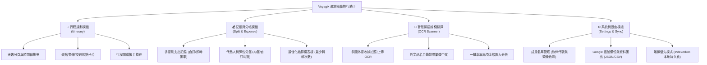

# 產品功能提案報告 (PRODUCT FEATURE PROPOSAL)

> **專案代號**：Travel-Flow (暫定)  
> **研發管線階段**：【階段 1：靈感與趨勢探索】完成 ➔ 進入【🚦 Gate 0：視覺選色與 Grill Me 深度對齊】  
> **分析規範**：遵循 `webapp-ideation`、`pm-skills` 與 `product-pipeline` 標準規範  

---

## 1. 執行摘要 (Executive Summary)

**一句話價值主張**：  
專為台灣旅人打造的「極簡無負擔、行程與分帳一體化」旅遊 Web App。徹底消滅出國面對外文收據的記帳失憶、打破強迫所有旅伴下載註冊的社交壓力，結合相機 OCR 智慧辨識翻譯、多幣別最小轉帳次數分帳演算法，與景點行程時間軸無縫整合。

---

## 2. 情報與社群背書 (Landscape Survey & Evidence)

經調研 Dcard、Threads、PTT 旅遊板及全球最新 Travel Tech 趨勢，歸納出四大關鍵痛點與社群信號：

### 2.1 社群痛點洞察 (Threads & Dcard)
1. **「逼朋友下載 App」的社交阻力**：
   * 市面主流分帳工具（如 Splitwise、Settle Up）需要每位旅伴都註冊帳號，但在 3~5 天的短程日本/東南亞旅行中，許多朋友嫌麻煩不願下載，最後帳目依舊混亂。
   * **解法**：Web App 架構（PWA / 手機瀏覽器開啟即用），由主記人發起旅程，旅伴可免登入以訪客檢視模式即時查看帳目與行程。
2. **國外外文收據「回飯店集體失憶」**：
   * 出國（特別是日本、韓國）一整天拿到厚厚一疊熱感應收據，品名全為日文片假名或韓文。回飯店記帳時根本分不清哪張是便利商店、哪張是居酒屋。
   * **解法**：拍照 OCR 辨識，自動擷取金額、幣別、消費時間，並直接將外文品名翻譯為繁體中文，自動歸類餐飲/交通/門票。
3. **分帳爭議與「匯率/誰沒吃」的尷尬**：
   * 「我不喝酒精飲品為何要平攤酒錢？」、「刷卡當天匯率跟現金換匯不同怎麼算？」。
   * **解法**：支援「整筆均攤」與「自訂品項勾選（誰有點/誰沒點）」，並內建即時多國匯率換算與自訂結算匯率。
4. **行程與記帳的割裂**：
   * 目前旅客常常在「去趣/Google Maps/Notion」看行程，到了餐廳付完錢又切去「LINE/計算機/分帳App」記帳，兩者毫無連結。
   * **解法**：行程節點直接掛載消費支出。在景點或餐廳打卡時，一鍵拍照記帳，自動關聯該行程節點。

---

## 3. 發散構思 (SCAMPER Analysis)

| SCAMPER 維度 | 創新發想與機制說明 |
| :--- | :--- |
| **S (替代 - Substitute)** | 用多模態 OCR 拍照辨識，**徹底替代**手動鍵盤輸入日期、店名、外幣金額與明細。 |
| **C (結合 - Combine)** | **結合**「行程時間軸」與「記帳分帳」，在排程中的餐廳/景點節點直接附掛帳單，行程結束即是完整帳本。 |
| **A (改編 - Adapt)** | 借鑑金融清算中的「**最小現金流演算法 (Min Cash Flow Algorithm)**」，將多人互相代墊的網狀欠款化簡為最少筆一對一轉帳。 |
| **M (放大/縮小 - Modify)** | **極小化**介面干擾：徹底移除所有彩色 Emoji 與花俏插圖，採用純 Lucide 向量細線圖標與低飽和冷灰調，強化單手拇指操作熱區。 |
| **P (轉用 - Put to another use)** | 將國外收據轉化為「**旅行美食回憶札記**」，翻譯後的明細不只是帳目，更記錄了旅途吃過的特色菜餚。 |
| **E (消除 - Eliminate)** | **消除**所有旅伴強制註冊登入門檻；主記人登入（Firebase Google Sign-in），旅伴免帳號一鍵看帳與清算。 |
| **R (反向 - Reverse)** | 從傳統「旅程結束痛苦對帳整夜」，**反向轉變**為「旅途中隨拍即記、離線快取，旅途最後一刻一秒清算完畢」。 |

---

## 4. 臺灣在地化適配矩陣 (Taiwan Localization Matrix)

1. **幣別與匯率情境**：
   * 預設支援臺灣人最常出境之幣別：TWD (新台幣)、JPY (日圓)、KRW (韓元)、USD (美元)、EUR (歐元)、THB (泰銖)。
   * 支援現金換匯成本自訂匯率，亦支援預設參考匯率。
2. **用語與排版體驗**：
   * 嚴格採用臺灣繁體中文在地用語（「代墊」、「分帳」、「結算」、「明細」），拒絕生硬大陸翻譯。
   * 移動端優先（Mobile First），專為通勤/行走中單手操作設計，重要按鈕（拍照、新增花費、切換天數）置於大拇指下半部舒適區。
3. **綠能與免費基礎設施**：
   * 架構規劃符合用戶習慣：Google Firebase Auth 驗證 + 本機 IndexedDB 離線秒存 + GitHub / Cloudflare Pages 免費邊緣加速部署（月維護費用 0 元）。

---

## 5. 建議之功能模組架構

---

## 6. 下一步：🚦 Gate 0 決策卡點

依據 `product-pipeline` 流程，在啟動產品三人組 (PM, UI/UX, Tech Lead) 深度辯論前，現已到達 **Gate 0 視覺選色與 Grill Me 深度對齊** 階段，請參閱互動確認卡進行拍板。
